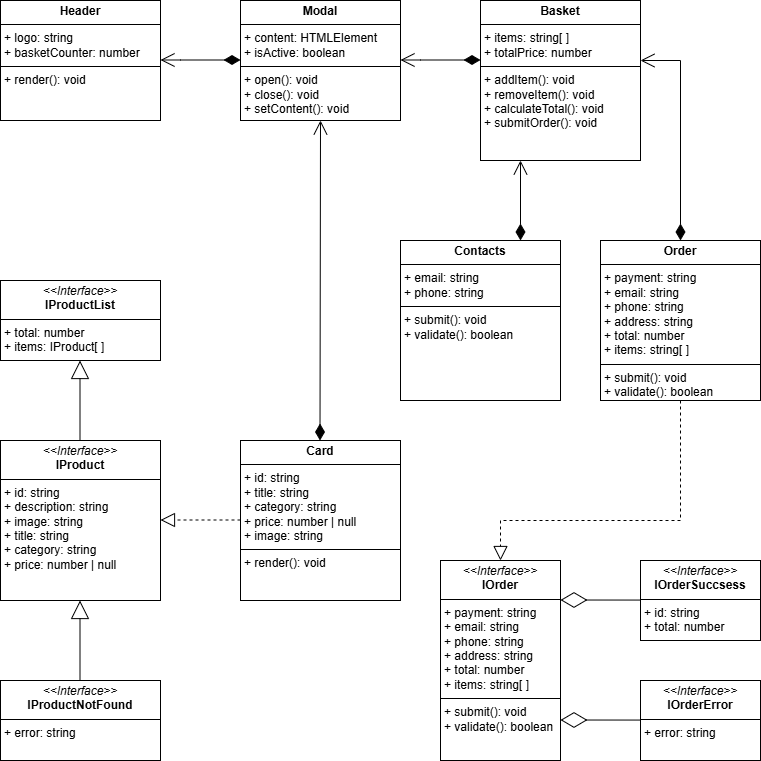

# Проектная работа "Веб-ларек"

Стек: HTML, SCSS, TS, Webpack

Структура проекта:

- src/ — исходные файлы проекта
- src/components/ — папка с JS компонентами
- src/components/base/ — папка с базовым кодом

Важные файлы:

- src/pages/index.html — HTML-файл главной страницы
- src/types/index.ts — файл с типами
- src/index.ts — точка входа приложения
- src/scss/styles.scss — корневой файл стилей
- src/utils/constants.ts — файл с константами
- src/utils/utils.ts — файл с утилитами

## Установка и запуск

Для установки и запуска проекта необходимо выполнить команды

```
npm install
npm run start
```

или

```
yarn
yarn start
```

## Сборка

```
npm run build
```

или

```
yarn build
```

## Архитектура



## Базовый код

### 1. Класс `Api`

Класс `Api` представляет собой универсальный инструмент для работы с HTTP-запросами. Он предоставляет методы для выполнения GET и POST-подобных запросов (включая PUT и DELETE) к удаленному серверу. Класс поддерживает настройку базового URL и параметров запроса, таких как заголовки, и предоставляет обработку ответов от сервера.

`constructor(baseUrl: string, options: RequestInit = {})` Конструктор принимает базовый URL (`baseUrl`) для API и опциональные параметры запроса (`options`). Параметры запроса могут включать заголовки, таймауты и другие настройки. Если заголовки не переданы, по умолчанию используется заголовок `'Content-Type': 'application/json'`.

#### Поля класса

- `readonly baseUrl: string` Хранит базовый URL для всех запросов. Этот URL используется как префикс для всех URI, передаваемых в методы `get` и `post`.
- `protected options: RequestInit` Хранит параметры запроса, такие как заголовки, методы и другие настройки. Эти параметры применяются ко всем запросам, выполняемым через экземпляр класса.

#### Методы класса

- `protected handleResponse(response: Response): Promise<object>` Обрабатывает HTTP-ответ от сервера. Если статус ответа успешный (`response.ok`), метод возвращает JSON-данные. В противном случае он создает ошибку, используя поле `error` из JSON-ответа или текст состояния HTTP.
- `get(uri: string)` Выполняет GET-запрос к указанному URI. Метод добавляет URI к базовому URL и отправляет запрос с использованием параметров, определенных в `options`. Результат обрабатывается методом `handleResponse`.
- `post(uri: string, data: object, method: ApiPostMethods = 'POST')` Выполняет POST-, PUT- или DELETE-запрос к указанному URI. Метод принимает данные (`data`), которые будут отправлены в теле запроса, и тип HTTP-метода (`method`). По умолчанию используется метод `POST`. Данные преобразуются в JSON-формат перед отправкой. Результат обрабатывается методом `handleResponse`.

#### Типы, связанные с классом

- `ApiListResponse<Type>` Тип описывает структуру ответа от сервера, содержащего список элементов. Содержит два поля:

  - `total: number` — общее количество элементов.
  - `items: Type[]` — массив элементов типа `Type`.

- `ApiPostMethods` Тип описывает допустимые HTTP-методы для метода `post`: `'POST'`, `'PUT'`, `'DELETE'`.

Класс `Api` предоставляет удобный и унифицированный способ взаимодействия с сервером через HTTP-запросы. Его методы позволяют выполнять основные операции CRUD (создание, чтение, обновление, удаление) с данными, а использование типов, таких как `ApiListResponse<Type>` и `ApiPostMethods`, делает код более безопасным и читаемым.

### 2. Класс `Component<T>`

Класс `Component<T>` представляет собой абстрактный базовый класс для создания компонентов пользовательского интерфейса. Он предоставляет инструментарий для работы с DOM-элементами, такими как управление классами, текстовым содержимым, состоянием блокировки, видимостью, изображениями и т.д. Этот класс является универсальным и может быть расширен для создания специализированных компонентов.

`constructor(protected readonly container: HTMLElement)` Конструктор принимает корневой DOM-элемент компонента, который будет использоваться всеми методами класса для выполнения операций с DOM.

#### Поля класса

- `protected readonly container: HTMLElement` Хранит ссылку на корневой DOM-элемент, который является контейнером для компонента.

#### Методы класса

- `toggleClass(element: HTMLElement, className: string, force?: boolean):void` Переключает указанный класс для элемента. Если параметр `force` не передан, класс будет добавлен, если его нет, и удален, если он уже существует. Если `force` указан, то класс будет добавлен (`true`) или удален (`false`), независимо от текущего состояния.
- `setText(element: HTMLElement, value: unknown): void` Устанавливает текстовое содержимое элемента. Если `value` равно `null` или `undefined`, оно будет преобразовано в пустую строку.
- `setDisabled(element: HTMLElement, state: boolean): void` Блокирует или разблокирует элемент, добавляя или удаляя атрибут `disabled`.
- `setHidden(element: HTMLElement): void` Скрывает элемент, устанавливая его стиль `display` в значение `none`.
- `setVisible(element: HTMLElement): void` Показывает элемент, удаляя свойство `display` из его стилей.
- `setImage(element: HTMLImageElement, src: string, alt?: string): void` Устанавливает атрибут `src` для изображения и, при необходимости, альтернативный текст (`alt`).
- `render(data?: Partial<T>): HTMLElement` Применяет переданные данные к текущему экземпляру компонента (если они есть) и возвращает корневой DOM-элемент. Используется для рендеринга компонента.

Класс `Component<T>` предоставляет мощный и гибкий инструментарий для создания UI-компонентов. Его методы позволяют легко манипулировать DOM-элементами, а абстрактная природа класса делает его удобным для расширения в дочерних классах.

### 3. Класс `EventEmitter`

Реализует паттерн «Наблюдатель» и позволяет подписываться на события и уведомлять подписчиков
о наступлении события.

Класс имеет методы `on`, `off`, `emit` — для подписки на событие, отписки от события и уведомления
подписчиков о наступлении события соответственно.

Дополнительно реализованы методы `onAll` и `offAll` — для подписки на все события и сброса всех
подписчиков.

Интересным дополнением является метод `trigger`, генерирующий заданное событие с заданными
аргументами. Это позволяет передавать его в качестве обработчика события в другие классы. Эти
классы будут генерировать события, не будучи при этом напрямую зависимыми от класса EventEmitter.

### 4. Класс `Model<T>`

Класс `Model<T>` представляет собой базовую модель, которая используется для работы с данными в приложении. Его основная задача — предоставить структуру для хранения данных, а также механизм для уведомления других частей приложения об изменениях в модели (паттерн "Наблюдатель"). Этот класс служит абстрактным базовым классом, который можно расширять для создания конкретных моделей с определённой структурой данных.

#### Конструктор:

`constructor(data: Partial<T>, protected events: IEvents)`

Конструктор принимает данные и объект событий, затем использует `Object.assign` для копирования переданных данных в текущий экземпляр модели. Это позволяет динамически создавать свойства модели на основе входных данных.

Параметры:

- `data: Partial<T>` — частичный объект данных, который будет использоваться для инициализации модели. Это позволяет передавать только те поля, которые необходимы, а остальные будут проинициализированы как `undefined`.
- `events: IEvents` — экземпляр интерфейса `IEvents`, который отвечает за управление событиями. Используется для уведомления подписчиков об изменениях в модели.

#### Поля класса:

`protected events: IEvents`

Назначение: Хранит ссылку на объект событий, который используется для генерации уведомлений об изменениях в модели. Это поле защищено (protected), чтобы оно могло быть доступно только внутри класса и его потомков.

`Динамические поля (из data)`

Назначение: Эти поля создаются динамически на основе переданных данных в конструкторе. Они представляют собой состояние модели и могут содержать любые данные, соответствующие типу T.

#### Методы класса:

`emitChanges` Используется для уведомления всех подписчиков о том, что модель изменилась. Он вызывает метод `emit` у объекта `events`, передавая название события и данные. Это позволяет другим частям приложения реагировать на изменения в модели.

Параметры:

- `event: string` — название события, которое будет отправлено подписчикам.
- `payload?: object` — дополнительные данные, которые могут быть переданы вместе с событием. Если параметр не указан, используется пустой объект `{}`.

Возвращаемое значение: `void`

## Model

### 1. Класс `Basket`

Класс `Basket` представляет собой компонент корзины покупок. Он отвечает за отображение списка товаров в корзине, обновление общей стоимости товаров и управление состоянием кнопки оформления заказа.

#### Зона ответственности:

- Отображение списка товаров в корзине.
- Обновление общей стоимости товаров.
- Управление состоянием кнопки оформления заказа (активна/неактивна).
- Генерация событий для взаимодействия с другими компонентами (например, открытие формы заказа).

#### Конструктор:

`constructor(container: HTMLElement, protected events: EventEmitter)`

##### Параметры конструктора:

`container: HTMLElement`
Представляет контейнер, в котором будет отображаться корзина.
Используется для поиска внутренних элементов корзины (список товаров, поле общей стоимости, кнопка).

`events: EventEmitter`
Экземпляр класса `EventEmitter`, который используется для генерации событий (например, открытие формы заказа при клике на кнопку).

##### Логика работы:

Выполняет инициализацию внутренних элементов корзины (`_list`, `_total`, `_button`).
Добавляет обработчик события клика на кнопку оформления заказа, который генерирует событие `order:open`.
Инициализирует список товаров как пустой массив.

#### Поля класса:

`_list: HTMLElement`

- Хранит ссылку на элемент, представляющий список товаров в корзине.
- Используется для добавления или удаления элементов из списка.

`_total: HTMLElement | null`

- Хранит ссылку на элемент, отображающий общую стоимость товаров.
- Если элемент не найден, значение будет `null`.

`_button: HTMLElement | null`

- Хранит ссылку на кнопку оформления заказа.
- Если кнопка не найдена, значение будет `null`.

`items: HTMLElement[] (set)`

- Принимает массив элементов, представляющих товары в корзине.
- Если массив пуст, отображается сообщение "Корзина пуста".

`selected: string[] (set)`

- Принимает массив идентификаторов выбранных товаров.
- Управляет состоянием кнопки оформления заказа (активна, если есть выбранные товары).

`total: number (set)`

- Принимает числовое значение общей стоимости товаров.
- Отображает форматированное значение в элементе `_total`.

#### Методы класса:

1. `set items` Обновляет отображение списка товаров в корзине.

Параметры:
`items: HTMLElement[]` — массив элементов, представляющих товары в корзине.

Логика работы:
Если массив содержит элементы, они заменяют содержимое списка `_list`.
Если массив пуст, в списке отображается сообщение "Корзина пуста".

2. `set selected` Управляет состоянием кнопки оформления заказа на основе выбранных товаров.

Параметры:
`items: string[]` — массив идентификаторов выбранных товаров.

Логика работы:
Если массив содержит хотя бы один элемент, кнопка оформления заказа становится активной.
Если массив пуст, кнопка становится неактивной.

3. `set total` Обновляет отображение общей стоимости товаров в корзине.

Параметры:
`total: number` — числовое значение общей стоимости товаров.

Логика работы:
Форматирует значение с помощью функции `formatNumber` и устанавливает его в текстовое содержимое элемента `_total`.

Класс `Basket` инкапсулирует логику работы с корзиной покупок, обеспечивая удобное управление списком товаров, общей стоимостью и состоянием кнопки оформления заказа. Использование сеттеров позволяет легко обновлять состояние корзины извне, а генерация событий через `EventEmitter` обеспечивает взаимодействие с другими компонентами приложения.

### 2. Класс `Order`

Класс `Order` предназначен для управления данными заказа пользователя. Он отвечает за хранение информации о заказе (например, способ оплаты, контактные данные, адрес доставки, общая сумма и список товаров) и обеспечивает валидацию этих данных перед отправкой на сервер.

#### Конструктор:

`constructor(payment: string, email: string, phone: string, address: string, total: number, items: string[])`

Параметры конструктора:

`payment: string`

- Способ оплаты (например, "Наличные", "Карта").
- Предназначен для хранения выбранного пользователем способа оплаты.

`email: string`

- Электронная почта пользователя.
- Предназначен для хранения `email`, который будет использоваться для уведомлений.

`phone: string`

- Номер телефона пользователя.
- Предназначен для хранения номера телефона, который будет использоваться для связи.

`address: string`

- Адрес доставки.
- Предназначен для хранения адреса, по которому будет доставлен заказ.

`total: number`

- Общая сумма заказа.
- Предназначен для хранения общей стоимости всех товаров в заказе.

`items: string[]`

- Массив идентификаторов товаров.
- Предназначен для хранения списка товаров, добавленных в заказ.

#### Поля класса

`payment: string`

- Данные: Строка, содержащая способ оплаты.
- Предназначение: Хранит выбранный пользователем способ оплаты (например, "Наличные" или "Карта").

`email: string`

- Данные: Строка, содержащая электронную почту пользователя.
- Предназначение: Хранит email, который будет использоваться для отправки уведомлений.

`phone: string`

- Данные: Строка, содержащая номер телефона пользователя.
- Предназначение: Хранит номер телефона, который будет использоваться для связи.

`address: string`

- Данные: Строка, содержащая адрес доставки.
- Предназначение: Хранит адрес, по которому будет доставлен заказ.

`total: number`

- Данные: Число, представляющее общую сумму заказа.
- Предназначение: Хранит общую стоимость всех товаров в заказе.

`items: string[]`

- Данные: Массив строк, содержащий идентификаторы товаров.
- Предназначение: Хранит список товаров, добавленных в заказ.

#### Методы класса

`submit` Отправляет данные заказа на сервер или в обработчик.

Входные данные: Нет.
Выходные данные: Нет.

Назначение:

- Вызывает метод `validate()` для проверки корректности данных.
- Если данные валидны, отправляет их на сервер или вызывает соответствующий обработчик (например, через событие).
- Если данные не валидны, выводит сообщение об ошибке или уведомляет пользователя о необходимости исправить данные.

`validate` Проверяет корректность данных заказа.

Входные данные: Нет.
Выходные данные:
`boolean — true`, если данные валидны; `false`, если данные невалидны.

Назначение:

- Проверяет, заполнены ли все обязательные поля (например, `payment`, `email`, `phone`, `address`).
- Проверяет формат `email` (например, содержит символ `@` и домен).
- Проверяет формат номера телефона (например, содержит только цифры и имеет допустимую длину).
- Проверяет, что массив `items` не пустой.
- Возвращает результат проверки.

Класс `Order` предоставляет удобный способ управления данными заказа. Он содержит поля для хранения ключевых характеристик заказа (способ оплаты, контактные данные, адрес доставки, общая сумма и список товаров), а также методы для их валидации и отправки. Этот класс является важной частью бизнес-логики приложения, так как гарантирует корректность данных перед отправкой на сервер.

## View

### 1. Класс `Form<T>`

Класс `Form<T>` представляет собой универсальный компонент для работы с формами. Он управляет состоянием полей формы, валидацией и отображением ошибок, а также генерирует события при изменении данных или отправке формы.

#### Зона ответственности:

- Управление состоянием полей формы (ввод данных, обновление значений).
- Валидация формы и управление состоянием кнопки отправки.
- Отображение ошибок валидации.
- Генерация событий для взаимодействия с другими компонентами (например, при изменении поля или отправке формы).

#### Конструктор:

`constructor(protected container: HTMLFormElement, protected events: IEvents)`

##### Параметры конструктора:

`container: HTMLFormElement`

- Представляет DOM-элемент формы, который будет управляться этим компонентом.
- Используется для поиска внутренних элементов (кнопка отправки, блок ошибок).

`events: IEvents`

- Экземпляр интерфейса `IEvents`, который используется для генерации событий (например, при изменении полей или отправке формы).

##### Логика работы:

- Инициализирует внутренние элементы формы (`_submit` — кнопка отправки, `_errors` — блок ошибок).
- Добавляет обработчик события `input` для отслеживания изменений в полях формы. При изменении значения поля вызывается метод `onInputChange`.
- Добавляет обработчик события `submit` для предотвращения стандартного поведения формы и генерации события отправки.

#### Поля класса:

`_submit: HTMLButtonElement`

- Хранит ссылку на кнопку отправки формы.
- Используется для управления состоянием кнопки (активна/неактивна).

`_errors: HTMLElement`

- Хранит ссылку на элемент, отображающий ошибки валидации.
- Используется для обновления текста ошибок.

`valid: boolean (set)`

- Принимает логическое значение, указывающее, является ли форма валидной.
- Управляет состоянием кнопки отправки (активна, если форма валидна).

`errors: string (set)`

- Принимает строку с текстом ошибок валидации.
- Отображает текст ошибок в элементе `_errors`.

#### Методы класса:

`onInputChange` Уведомляет другие компоненты об изменении значения поля формы.

Параметры:
`field: keyof T` — имя поля формы (ключ объекта типа T).
`value: string` — новое значение поля.

Логика работы:
Генерирует событие `${this.container.name}.${String(field)}:change` с данными о поле и его новом значении.

`set valid` Управляет состоянием кнопки отправки на основе валидности формы.

Параметры:
`value: boolean` — состояние валидности формы.

Логика работы:

- Если `value` равно `true`, кнопка отправки становится активной.
- Если `value` равно `false`, кнопка отправки становится неактивной.

`set errors` Отображает сообщения об ошибках валидации пользователю.

Параметры:
`value: string` — текст ошибок валидации.

Логика работы:
Устанавливает текст ошибок в элементе `_errors`.

`render` Обновляет состояние формы и отображение на основе переданных данных.

Параметры:
`state: Partial<T> & IFormState` — объект, содержащий текущее состояние формы:
`valid: boolean` — состояние валидности формы.
`errors: string[]` — массив ошибок валидации.
Остальные свойства соответствуют полям формы (тип T).

Логика работы:
Разделяет состояние на две части:
`valid` и `errors` передаются в базовый метод `super.render`.
Остальные свойства (поля формы) обновляются через `Object.assign`.

Возвращает обновленный DOM-элемент формы.

Класс `Form<T>` предоставляет универсальное решение для работы с формами, инкапсулируя логику управления состоянием полей, валидации и отображения ошибок. Использование генерации событий через `IEvents` позволяет легко интегрировать форму с другими компонентами приложения. Метод `render` обеспечивает удобное обновление состояния формы и ее отображения.

### 2. Класс `Modal`

Класс `Modal` представляет собой компонент для управления модальными окнами. Он отвечает за отображение, закрытие и обновление содержимого модального окна, а также генерирует события при открытии и закрытии.

#### Зона ответственности:

- Отображение и скрытие модального окна.
- Управление содержимым модального окна.
- Обработка событий кликов для закрытия модального окна (по кнопке закрытия или по фону).
- Генерация событий для взаимодействия с другими компонентами (например, уведомление о том, что модальное окно открыто или закрыто).

#### Коструктор:

`constructor(container: HTMLElement, protected events: IEvents)`

##### Параметры конструктора:

`container: HTMLElement`

- Представляет DOM-элемент контейнера модального окна.
- Используется для поиска внутренних элементов (кнопка закрытия, блок содержимого).

`events: IEvents`
Экземпляр интерфейса `IEvents`, который используется для генерации событий (например, при открытии или закрытии модального окна).

##### Логика работы:

- Инициализирует внутренние элементы модального окна (`_closeButton` — кнопка закрытия, `_content` — блок содержимого).

- Добавляет обработчики событий:
  - Клик на кнопку закрытия вызывает метод `close`.
  - Клик на фон модального окна вызывает метод `close`.
  - Клик внутри блока содержимого предотвращается с помощью `stopPropagation`.

#### Поля класса:

`_closeButton: HTMLButtonElement`

- Хранит ссылку на кнопку закрытия модального окна.
- Используется для добавления обработчика клика.

`_content: HTMLElement`

- Хранит ссылку на блок содержимого модального окна.
- Используется для обновления содержимого модального окна.

`content: HTMLElement (set)`

- Принимает новый элемент для отображения в качестве содержимого модального окна.
- Если передано значение `null`, очищает содержимое.

#### Методы класса:

`set content` Обновляет содержимое модального окна.

Параметры:
`value: HTMLElement` — элемент, который будет отображен в модальном окне.

Логика работы:

- Заменяет содержимое блока `_content` новым элементом.
- Если передано значение `null`, очищает содержимое.

`open` Открывает модальное окно и уведомляет другие компоненты о его открытии.

Логика работы:

- Добавляет класс `modal_active` к контейнеру модального окна, делая его видимым.
- Генерирует событие `modal:open`.

`close` Закрывает модальное окно и уведомляет другие компоненты о его закрытии.

Логика работы:

- Удаляет класс `modal_active` из контейнера модального окна, скрывая его.
- Очищает содержимое модального окна.
- Генерирует событие `modal:close`.

`render` Рендерит новое содержимое модального окна и открывает его. Возвращает обновленный DOM-элемент модального окна.

Параметры:
`data: IModalData` — объект, содержащий данные для отображения:
`content: HTMLElement` — элемент, который будет отображен в модальном окне.

Логика работы:

- Вызывает базовый метод `super.render(data)` для обновления состояния.
- Открывает модальное окно с помощью метода `open`.

Класс `Modal` предоставляет универсальное решение для управления модальными окнами. Он инкапсулирует логику отображения, скрытия и обновления содержимого, а также генерирует события для взаимодействия с другими компонентами приложения. Использование обработчиков событий и методов управления состоянием делает класс удобным для повторного использования в различных частях приложения.

### 3. Класс `Success`

Класс `Success` представляет собой компонент для отображения успешного завершения операции (например, успешной оплаты или выполнения заказа). Он управляет состоянием интерфейса успеха и предоставляет возможность настройки действий пользователя после завершения операции.

#### Зона ответственности:

- Отображение информации об успешном завершении операции.
- Обеспечение взаимодействия с пользователем через кнопку действия (например, "Закрыть" или "Вернуться").
- Управление событиями, связанными с действиями пользователя (например, клик по кнопке).

#### Конструктор:

`constructor(container: HTMLElement, actions: ISuccessActions)`

Параметры конструктора:

`container: HTMLElement`

- Представляет DOM-элемент контейнера, который будет использоваться для отображения компонента успеха.
- Используется для поиска внутренних элементов (например, кнопки действия).

`actions: ISuccessActions`
Объект, содержащий колбэк-функции для обработки действий пользователя:

- `onClick: () => void` — функция, вызываемая при клике на кнопку действия.

Логика работы:

- Инициализирует внутренний элемент `_close`, представляющий кнопку действия.
- Если передан колбэк `onClick`, добавляет обработчик события клика на кнопку действия.

#### Поля класса:

`_close: HTMLElement`
Хранит ссылку на кнопку действия (например, "Закрыть" или "Вернуться").
Используется для управления поведением кнопки и добавления обработчиков событий.

#### Методы класса:

Нет явно определенных методов в классе.

Класс `Success` предоставляет базовую структуру для отображения успешного завершения операции. Он инкапсулирует логику управления кнопкой действия и позволяет настраивать поведение пользователя через колбэк-функции. Хотя в текущей реализации функционал ограничен, класс легко расширяется для поддержки дополнительных возможностей, таких как отображение данных операции и управление состоянием интерфейса.

### 4. Класс `Card`

Класс `Card` предназначен для представления карточки товара в пользовательском интерфейсе. Он отвечает за хранение данных о товаре (например, идентификатор, название, категорию, цену и изображение) и их отображение.

#### Конструктор:

`constructor(id: string, title: string, category: string, price: number | null, image: string)`

Параметры конструктора :

`id: string`

- Уникальный идентификатор товара.
- Предназначен для идентификации карточки товара в системе.

`title: string`

- Название товара.
- Используется для отображения заголовка карточки.

`category: string`

- Категория товара.
- Может использоваться для фильтрации или группировки товаров.

`price: number | null`

- Цена товара.
- Может быть числом (если цена известна) или `null` (если цена не указана).

`image: string`

- URL изображения товара.
- Используется для отображения изображения в карточке.

#### Поля класса:

`id: string`

- Данные: Уникальный идентификатор товара.
- Предназначение: Используется для однозначной идентификации товара в системе.

`title: string`

- Данные: Название товара.
- Предназначение: Отображается в карточке как заголовок.

`category: string`

- Данные: Категория товара.
- Предназначение: Может использоваться для дополнительного контекста или фильтрации.

`price: number | null`

- Данные: Цена товара.
- Предназначение: Отображается в карточке. Если цена равна null, может отображаться текст "Цена не указана".

`image: string`

- Данные: URL изображения товара.
- Предназначение: Используется для отображения изображения товара в карточке.

#### Методы класса:

`render` Рендерит карточку товара, создавая HTML-структуру на основе данных объекта. Создает HTML-элементы для отображения данных о товаре (изображение, название, категория, цена).

- Входные данные: Нет.
- Выходные данные: Нет.

Класс `Card` предоставляет удобный способ управления данными о товаре и их отображением в пользовательском интерфейсе. Он содержит поля для хранения ключевых характеристик товара (идентификатор, название, категория, цена, изображение) и методы для обновления и получения этих данных. Метод `render()` отвечает за создание HTML-структуры карточки товара, что делает класс незаменимым для работы с интерфейсом.

### 5. Класс `CardList`

Класс `CardList` предназначен для управления списком карточек товаров в пользовательском интерфейсе. Он отвечает за создание, добавление, удаление и обновление карточек товаров.

#### Конструктор:

`constructor(container: HTMLElement)`

Параметры конструктора:

`container: HTMLElement`

- HTML-элемент, в который будет встраиваться список карточек.
- Предназначен для привязки списка карточек к конкретному месту на странице.

#### Поля класса

`_list: HTMLElement`

- Данные: HTML-элемент, представляющий контейнер для списка карточек.
- Предназначение: Хранит ссылку на контейнер, в котором будут размещаться карточки товаров.

`_cards: Card[]`

- Данные: Массив экземпляров класса Card.
- Предназначение: Хранит все созданные карточки товаров, которые отображаются в списке.

#### Методы класса

`renderCards` Рендерит список карточек товаров на основе массива данных о товарах. Очищает текущий список карточек (если он существует). Создает новые карточки товаров (`Card`) для каждого элемента массива и добавляет их в контейнер `_list`.

Входные данные:
`items: IProduct[]` — массив объектов, содержащих данные о товарах (например, `id`, `title`, `category`, `price`, `image`).
Выходные данные: Нет.

`addCard` Добавляет новую карточку товара в список. Добавляет карточку в массив `_cards`. Встраивает HTML-элемент карточки в контейнер `_list`.

Входные данные:
`card: Card` — экземпляр класса `Card`, представляющий карточку товара.
Выходные данные: Нет.

`clear` Очищает список карточек. Удаляет все карточки из массива `_cards`. Очищает содержимое контейнера `_list`.

Входные данные: Нет.
Выходные данные: Нет.

Класс `CardList` предоставляет удобный способ управления списком карточек товаров. Он содержит поля для хранения контейнера и массива карточек, а также методы для рендеринга, добавления и очистки карточек. Этот класс является важной частью пользовательского интерфейса, так как отвечает за отображение и обновление списка товаров.

### 6. Класс `Contacts`

Класс `Contacts` предназначен для работы с контактными данными пользователя (например, `email` и телефон) в пользовательском интерфейсе. Он отвечает за валидацию введенных данных и отправку их на сервер или в обработчик.

#### Конструктор:

`constructor(email: string, phone: string)`

Параметры конструктора:

`email: string`

- Электронная почта пользователя.
- Предназначен для хранения `email`, который будет использоваться в форме контактов.

`phone: string`

- Номер телефона пользователя.
- Предназначен для хранения номера телефона, который будет использоваться в форме контактов.

#### Поля класса

`email: string`

- Данные: Строка, содержащая электронную почту пользователя.
- Предназначение: Хранит `email`, который может быть изменен или отправлен на сервер.

`phone: string`

- Данные: Строка, содержащая номер телефона пользователя.
- Предназначение: Хранит номер телефона, который может быть изменен или отправлен на сервер.

#### Методы класса

`submit` Отправляет контактные данные (`email` и `phone`) на сервер или в обработчик.

Входные данные: Нет.
Выходные данные: Нет.

Назначение:

- Вызывает метод `validate()` для проверки корректности данных.
- Если данные валидны, отправляет их на сервер или вызывает соответствующий обработчик (например, через событие).
- Если данные не валидны, выводит сообщение об ошибке или уведомляет пользователя о необходимости исправить данные.

`validate` Проверяет корректность контактных данных (`email` и `phone`).

Входные данные: Нет.
Выходные данные:
`boolean — true`, если данные валидны; `false`, если данные невалидны.

Назначение:

- Проверяет, соответствует ли `email` формату электронной почты (например, содержит символ `@` и домен).
- Проверяет, соответствует ли номер телефона определенному формату (например, содержит только цифры и имеет допустимую длину).
- Возвращает результат проверки.

Класс `Contacts` предоставляет удобный способ управления контактными данными пользователя. Он содержит поля для хранения `email` и номера телефона, а также методы для их валидации и отправки. Этот класс является важной частью пользовательского интерфейса, так как обеспечивает корректное взаимодействие с формой контактов и гарантирует, что отправляемые данные соответствуют требованиям.

### 7. Класс `Header`

Класс `Header` предназначен для управления шапкой страницы в пользовательском интерфейсе. Он отвечает за отображение логотипа, кнопки корзины и обновление информации о корзине (например, общая сумма товаров).

#### Конструктор:

`constructor(container: HTMLElement)`

Параметры конструктора:
`container: HTMLElement`

- HTML-элемент, представляющий контейнер шапки.
- Предназначен для привязки шапки к конкретному месту на странице.

#### Поля класса

`_logo: HTMLElement`

- Данные: HTML-элемент, представляющий логотип.
- Предназначение: Хранит ссылку на элемент логотипа, который отображается в шапке.

`_basketButton: HTMLElement`

- Данные: HTML-элемент, представляющий кнопку корзины.
- Предназначение: Хранит ссылку на кнопку корзины, которая используется для отображения информации о корзине (например, общая сумма товаров).

#### Методы класса

`updateBasket` Обновляет информацию о корзине (например, отображает общую сумму товаров).

Входные данные:
`total: number` — общая сумма товаров в корзине.
Выходные данные: Нет.

Назначение:

- Обновляет текстовое содержимое кнопки корзины (`_basketButton`) с новой информацией о сумме.
- Если сумма равна 0, может скрывать или изменять внешний вид кнопки (например, показывать "Корзина пуста").

Класс `Header` предоставляет удобный способ управления шапкой страницы. Он содержит поля для хранения ключевых элементов шапки (логотип и кнопка корзины), а также метод для обновления информации о корзине. Этот класс является важной частью пользовательского интерфейса, так как обеспечивает отображение и обновление данных в реальном времени.

## Presenter

### 3. Класс `Page`

Класс `Page` является координатором между всеми компонентами страницы (например, шапкой, корзиной, списком карточек товаров, модальным окном). Он отвечает за инициализацию этих компонентов, их настройку и обработку событий, которые происходят между ними.

#### Конструктор:

`constructor(header: Header, basket: Basket, cardList: CardList, modal: Modal)`

Параметры конструктора:

`header: Header`

- Экземпляр класса `Header`, представляющий шапку страницы.
- Предназначен для управления логотипом и кнопкой корзины.

`basket: Basket`

- Экземпляр класса `Basket`, представляющий корзину товаров.
- Предназначен для управления содержимым корзины и взаимодействия с пользователем.

`cardList: CardList`

- Экземпляр класса `CardList`, представляющий список карточек товаров.
- Предназначен для управления отображением и добавлением товаров.

`modal: Modal`

- Экземпляр класса `Modal`, представляющий модальное окно.
- Предназначен для отображения дополнительной информации (например, формы заказа).

#### Поля класса

`_header: Header`

- Данные: Экземпляр класса `Header`.
- Предназначение: Хранит ссылку на шапку страницы для управления её элементами.

`_basket: Basket`

- Данные: Экземпляр класса `Basket`.
- Предназначение: Хранит ссылку на корзину для управления её содержимым и обновления информации.

`_cardList: CardList`

- Данные: Экземпляр класса `CardList`.
- Предназначение: Хранит ссылку на список карточек товаров для управления их отображением и взаимодействием.

`_modal: Modal`

- Данные: Экземпляр класса `Modal`.
- Предназначение: Хранит ссылку на модальное окно для управления его отображением и содержимым.

#### Методы класса

`initHeader` Инициализирует шапку страницы.

Входные данные: Нет.
Выходные данные: Нет.

Назначение:

- Выполняет настройку шапки (например, обновление информации о корзине).
- Подписывается на события, связанные с шапкой (например, клик по кнопке корзины).

`initBasket` Инициализирует корзину.

Входные данные: Нет.
Выходные данные: Нет.

Назначение:

- Выполняет настройку корзины (например, загрузка данных о товарах из хранилища).
- Подписывается на события, связанные с корзиной (например, добавление или удаление товаров).

`initCardList` Инициализирует список карточек товаров.

Входные данные: Нет.
Выходные данные: Нет.

Назначение:

- Выполняет настройку списка карточек (например, рендеринг товаров из API).
- Подписывается на события, связанные с карточками (например, клик по кнопке "Добавить в корзину").

`initModal` Инициализирует модальное окно.

Входные данные: Нет.
Выходные данные: Нет.

Назначение:

- Выполняет настройку модального окна (например, отображение формы заказа).
- Подписывается на события, связанные с модальным окном (например, закрытие или отправка формы).

`handleEvents` Обрабатывает события между компонентами страницы.

Входные данные: Нет.
Выходные данные: Нет.

Назначение:

- Координирует взаимодействие между компонентами (например, обновление корзины при добавлении товара из карточки).
- Обрабатывает глобальные события (например, открытие модального окна при клике на кнопку "Оформить заказ").

Класс `Page` является ключевым компонентом приложения, который координирует работу всех частей интерфейса. Он содержит поля для хранения ссылок на основные компоненты страницы (шапка, корзина, список карточек, модальное окно) и методы для их инициализации и обработки событий. Этот класс играет роль презентера в архитектуре MVP, обеспечивая согласованную работу между моделью и представлением.
